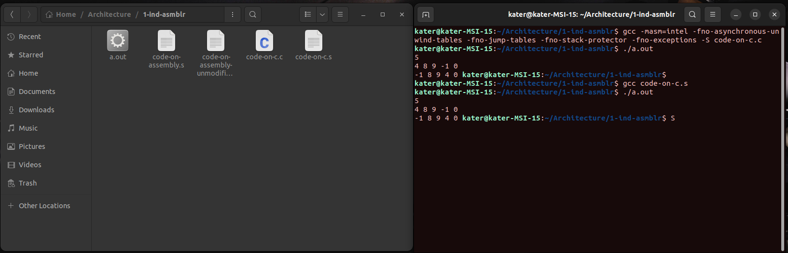

# Архитектура вычислительных систем. ИДЗ №1.

### Вариант 20. Сформировать массив B из элементов массива A перестановкой местами минимального и первого элементов.

#### Выполнил Старцев Евгений, БПИ219.

---

## Решение на 4 балла.

- #### Приведено решение на С `выполнено`

Код на C представлен в файле `code-on-c.c`. Так как задание решаю больше, чем на 4 балла, написал сразу с
использованием функций с передаваемыми параметрами. Все необходимые комментарии представлены внутри файла с кодом, а
также в части отчёта "Решение на 5 баллов".

- #### В полученную ассемблерную программу, откомпилированную без оптимизирующих и отладочных опций, добавлены комментарии, поясняющие эквивалентное представление переменных в программе на C `выполнено`

Ассемблерная программа получается из программы на C с помощью команды `gcc -masm=intel -S code-on-c.c` (опция
`-masm=intel` необходима для получения ассемблерного кода с синтаксисом Intel, она не является ни оптимизирующей, ни
отладочной). Исходный код с необходимыми комментариями находится в файле ```code-on-assembly-unmodified.s```. Покажу
некоторые эквивалентные представления переменных в программе на С в отчёте.

Строки 18-20 (здесь переменные из функции zapolnimMas)

```
	mov	QWORD PTR -24[rbp], rdi		# int* a
	mov	DWORD PTR -28[rbp], esi		# int n (size of a)
	mov	DWORD PTR -4[rbp], 0		# int i (index)
```

Строка 61

```
	mov	QWORD PTR -8[rbp], rax          # int q (in function int vvod(void))
```

Строки 92-98 (здесь переменные из функции posElem)

```
	mov	QWORD PTR -24[rbp], rdi		# int* a
	mov	DWORD PTR -28[rbp], esi		# int n 
	mov	rax, QWORD PTR -24[rbp]
	mov	eax, DWORD PTR [rax]
	mov	DWORD PTR -12[rbp], eax		# int minim
	mov	DWORD PTR -8[rbp], 0		# int pos
	mov	DWORD PTR -4[rbp], 1		# int i
```

- #### Из ассемблерной программы убраны лишние макросы за счет использования соответствующих аргументов командной строки и/или за счет ручного редактирования исходного текста ассемблерной программы `выполнено`

Лишние макросы были убраны за счёт использования аргументов командной строки. Итоговая команда для получения такой
ассемблерной программы выглядит следующим образом:

`gcc -masm=intel -fno-asynchronous-unwind-tables -fno-jump-tables -fno-stack-protector -fno-exceptions -S code-on-c.c`

где `-fno-asynchronous-unwind-tables` отключает генерацию отладочной информации, `-fno-jump-tables` отключает
jump-таблицы, `-fno-stack-protector` отключает стековый индикатор, `-fno-exceptions` для более корректной работы с
исключениями.

Исходный код модифицированной программы находится в файле `code-on-assembly.s`.

- #### Модифицированная ассемблерная программа отдельно откомпилирована и скомпонована без использования опций отладки `выполнено`

Ассемблерная программа откомпилирована и скомпонована с помощью
команды ``gcc <название файла с ассемблерной программой>``. Прикреплю скриншот выполнения.



P.S. на скриншоте видно, что я выполнил компиляцию и запуска файла `code-on-c.s`. Этого файла нет в репозитории, но его
содержимое можно просмотреть в файле `code-on-assembly.s`.

- #### Представлено полное тестовое покрытие, дающее одинаковый результат на обеих программах. Приведены результаты тестовых прогонов для обеих программ, демонстрирующие эквивалентность функционирования `выполнено`

Обе программы (программа на C и модифицированная программа на ассемблере) были протестированы на одинаковом наборе
тестов, представленном ниже. Обе программы работают одинаково. Все скриншоты, демонстрирующие корректность, есть в
репозитории (файлы test<номер теста>.png)

### Тест 1.

Ввод

```
6
1 2 3 4 5 6
```

Вывод

```
1 2 3 4 5 6
```

### Тест 2.

Ввод

```
6 
8 5 4 -10 45 3
```

Вывод

```
-10 5 4 8 45 3
```

### Тест 3.

Ввод

```
10
45 0 21 -101 -102 39 21 54 34 20
```

Вывод

```
-102 0 21 -101 45 39 21 54 34 20
```

### Тест 4.

Ввод

```
2
2 1
```

Вывод

```
1 2
```

### Тест 5.

Ввод

```
1
0
```

Вывод

```
0
```

### Тест 6.

Ввод

```
4
-14 -23 -8 -5
```

Вывод

```
-23 -14 -8 -5
```

### Тест 7.

Ввод

```
20
0 0 0 14 -14 14 -14 0 9 9 -9 -9 10 10 -10 -10 5 5 5 5
```

Вывод

```
-14 0 0 14 0 14 -14 0 9 9 -9 -9 10 10 -10 -10 5 5 5 5
```

### Тест 8.

Ввод

```
3
3 2 1
```

Вывод

```
1 2 3
```

### Тест 9.

Ввод

```
8
100 0 0 0 0 0 0 0
```

Вывод

```
0 100 0 0 0 0 0 0
```

### Тест 10.

Ввод

```
8
100 1 2 3 4 5 6 -100
```

Вывод

```
-100 1 2 3 4 5 6 100
```

###

- #### Сформировать отчет, описывающий результаты тестовых прогонов и используемых опций компиляции и/или описания проведенных модификаций `выполнено`

Отчёт вы читаете прямо сейчас:)

## Решение на 5 баллов

- #### В реализованной программе использовать функции с передачей данных через параметры `выполнено`

Реализованные функции:

- `void zapolnimMas(int* a, int n)` - функция для заполнения массива A. `int* a` - массив А, `int n` - размер массива А.
- `int vvod(void)` - функция для ввода числа. Возвращает введённое число.
- `int posElem(const int* a, int n)` - функция для поиска позиции минимального элемента. `const int* a` - массив
  А, `int n` -
  размер массива А. Возвращает позицию минимального элемента в массиве А.
- `void zapolnimB(const int* a, int* b, int pos, int n)` - функция для заполнения массива B. `const int* a` - массив
  А, `int* b` - массив B, `int pos` - позиция минимального элемента, `int n` - размер массива А.

Содержимое функций смотрите в файле с кодом на С.

- #### Использовать локальные переменные `выполнено`

В коде не было использовано ни одной глобальной переменной (смотрите файл с кодом на C).

- #### В ассемблерную программу при вызове функции добавить комментарии, описывающие передачу фактических параметров и перенос возвращаемого результата `выполнено`

В данном требовании не указано, нужно ли добавлять комментарии во все функции или же в какую-то конкретную, поэтому
рассмотрим одну функцию - `zapolnimB`. Конкретно рассмотрим передачу параметров и перенос результата.

В каждую функцию передаются определённые параметры, внутри функции с использованием этих параметров происходят какие-то
действия. Рассмотрим функцию `zapolnimB` (начало в строке 101 в файле `code-on-assembly.s`, ниже представлены строки
105-110)
.

```
    mov QWORD PTR -24[rbp], rdi		# const int* a - переданный параметр
    mov QWORD PTR -32[rbp], rsi		# int* b - переданный параметр
    mov DWORD PTR -36[rbp], edx		# int pos - переданный параметр
    mov DWORD PTR -40[rbp], ecx		# int n - переданный параметр
    mov DWORD PTR -4[rbp], 0		# int i - параметр, инициализированный в функции
    jmp .L12				# переход к L12
```

Первые четыре переменные - переменные, которые были переданы в функцию. Пятая же переменная (i) была инициализирована
уже внутри функции. Строка `jmp .L12` переходит к выполнению кода в L12, из L12 происходит переход в L16, из L16 в L13 и
т.д. (кстати, для переходов используются разные команды - `jmp`, `jne`, `jl` - каждая используется при различных
условиях (можно провести аналогию с if else). Так как в исходной программе на C у нас используется цикл, то можно
сказать, что в L12-L16 выполняется своего рода цикл. В процессе выполнения как раз и происходят различные присвоения,
после которых получается необходимый результат.

Теперь рассмотрим выход из функции. Ниже - 161 и 162 строки программы.

```
    pop rbp		# отчистка стека
    ret
```

В 161 строке произошла отчистка стека, а в 162 - выход из функции.

- #### В функциях для формальных параметров добавить комментарии, описывающие связь между параметрами языка Си и регистрами (стеком) `выполнено`

Пример регистров - `eax`, `ebx`, `asi`, `rsi`, `rdi` и т.д.

Комментарии ко всем функциям добавлены. Рассмотрим на примере функции `print` (строки 175-177):

```
    mov QWORD PTR -24[rbp], rdi		# const int* a - в rdi
    mov DWORD PTR -28[rbp], esi		# int n - в esi
    mov DWORD PTR -4[rbp], 0		# int i = 0
```

Здесь массив `a` передаётся в `rdi`, а переменная `n` - в `esi`. А переменной `i` присваивается значение 0.

- #### Добавить информацию о проведенных изменениях в отчет `выполнено`

Всю информацию об изменениях вы только что прочитали))

## Небольшой вывод.

Главное всё делать аккуратно.